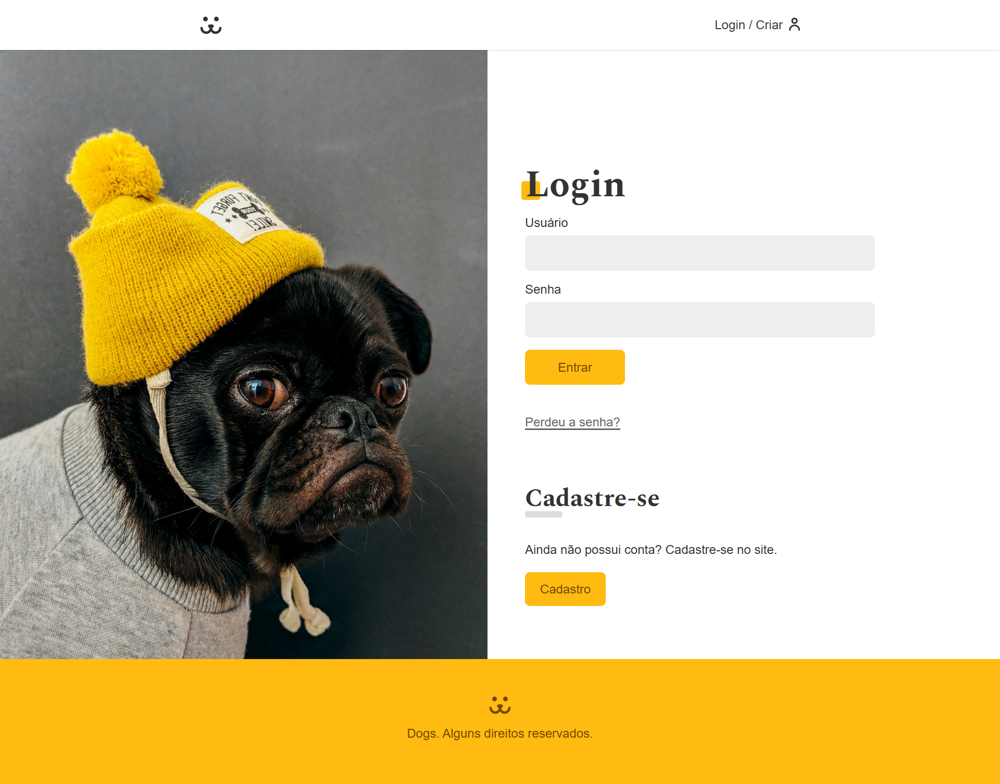

# 🐶 Dogs Social — Rede Social para Cães

Este é um projeto de **rede social voltada para cães e seus donos**, desenvolvida com **Vite + React**, utilizando **JWT Token** para autenticação e um visual moderno, divertido e responsivo. Os usuários podem criar contas, fazer login, cadastrar perfis de seus pets, interagir e compartilhar momentos fofos do dia a dia.

## 📸 Screenshot

## 🌟 Visão Geral

**Dogs Social** tem como objetivo criar um espaço online onde apaixonados por cães possam:

- Criar perfis personalizados para seus pets 🐕
- Publicar fotos, descrições e atualizações
- Curtir, comentar e seguir outros cães
- Interagir com a comunidade pet de forma segura e divertida

---

## 🚀 Funcionalidades

- 🔐 **Login seguro com autenticação via JWT**
- 🐾 Cadastro de **usuário e perfil do cão**
- 📷 Upload de fotos dos pets
- 💬 Sistema de **posts, curtidas e comentários**
- 🔎 Buscar perfis e fazer amizades caninas
- 🧑‍💻 Interface moderna e responsiva
- 📲 Design mobile-first

---

## 🛠️ Tecnologias Utilizadas

- ⚡ [Vite](https://vitejs.dev/) — Bundler super rápido para React
- ⚛️ [React](https://react.dev/) — Biblioteca moderna para interfaces
- 💅 CSS3, Styled Components ou CSS Modules
- 🌐 HTML5
- 🔒 [JWT (JSON Web Token)](https://jwt.io/) — Autenticação segura
- 📡 [Axios](https://axios-http.com/) — Requisições HTTP
- 🧭 [React Router DOM](https://reactrouter.com/) — Rotas SPA
- 🗃️ LocalStorage para armazenamento do token
- 🧰 Node.js + Express (no backend) com banco de dados relacional ou NoSQL
